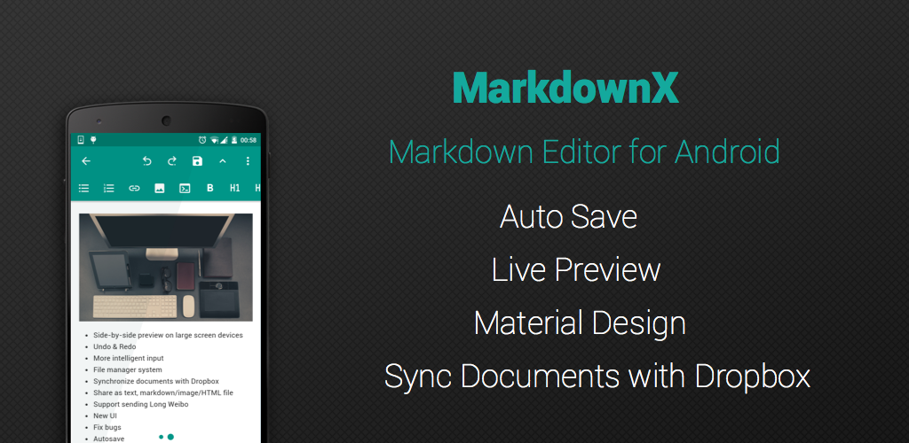
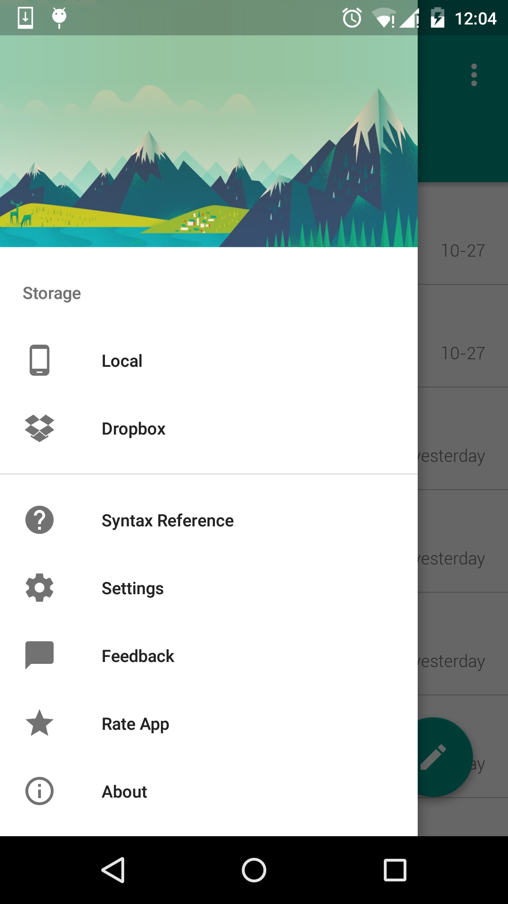
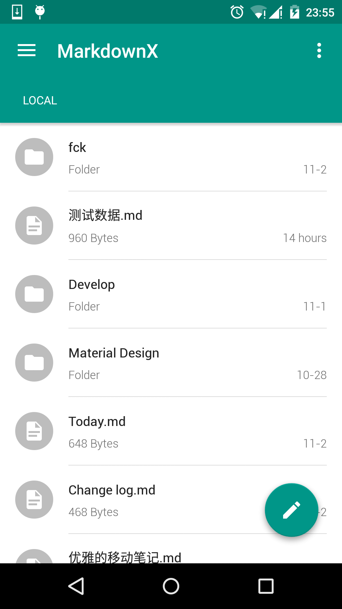
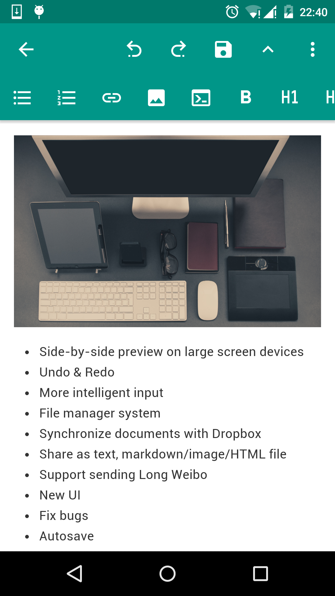
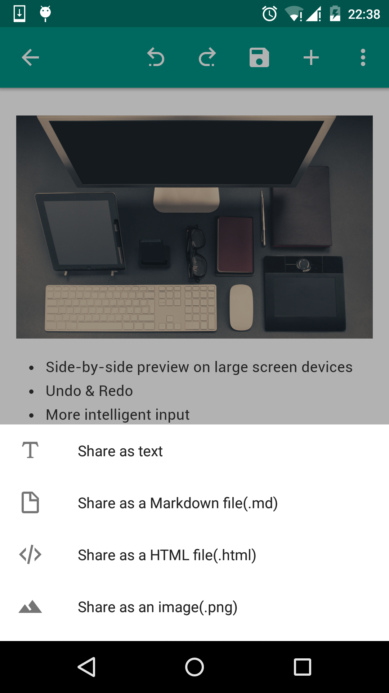
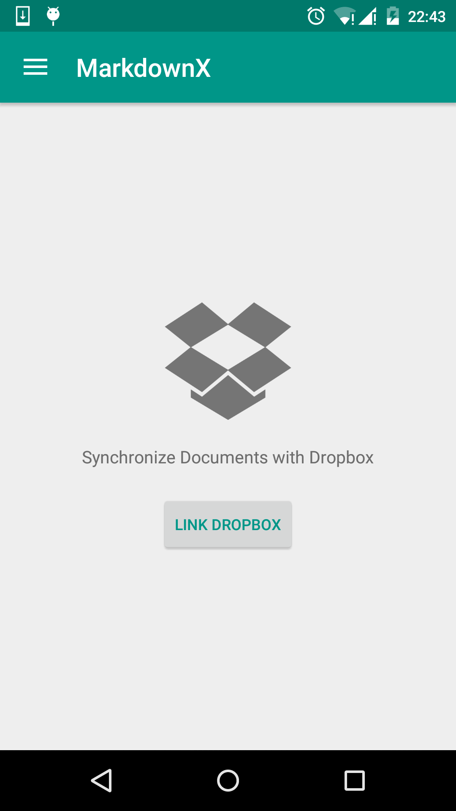
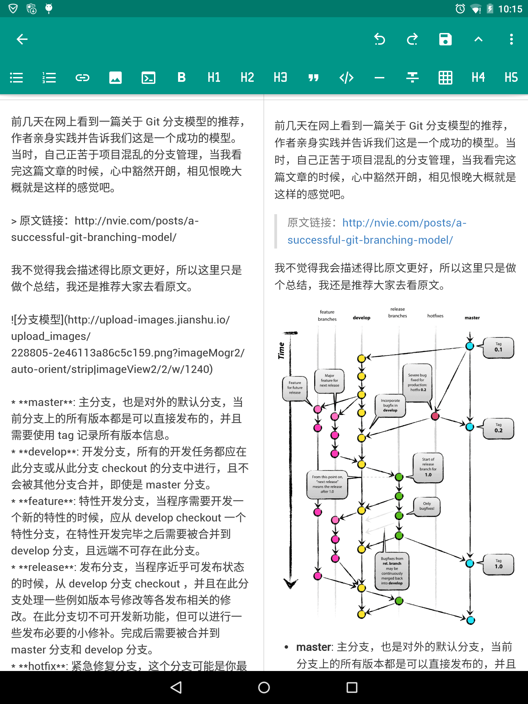

# MarkdownX

MarkdownX is a Markdown text editor for Android. It follows the principle of Material Design and is easy to use.

## Features
- Live preview
- Side-by-side preview on large screen devices
- Undo & Redo 
- More powerful actions
- File manager system
- Synchronize documents with Dropbox
- Share as text, markdown/image/HTML file
- Support sending Long Weibo 
- Material Design  
- Autosave 
- GFM support

If you meet some trouble, or you have some suggestions. contact us at spatblan@gmail.com

## Screenshots

## Change Log
### 1.1.1
- Add local files search supported

### 1.1.0
- Side-by-side preview on large screen devices
- Undo & Redo 
- More intelligent input
- File manager system
- Synchronize documents with Dropbox
- Share as text, markdown/image/HTML file
- Support sending Long Weibo 
- New UI 
- Fix bugs

### 1.0.1
- Add Chinese support
- Fix bugs

### 1.0.0
- Live preview
- Material Design  
- Autosave 
- GFM support

